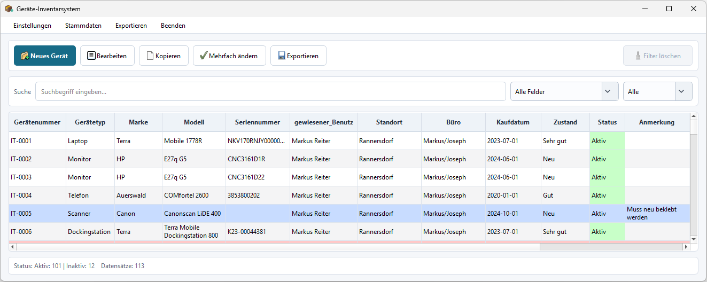
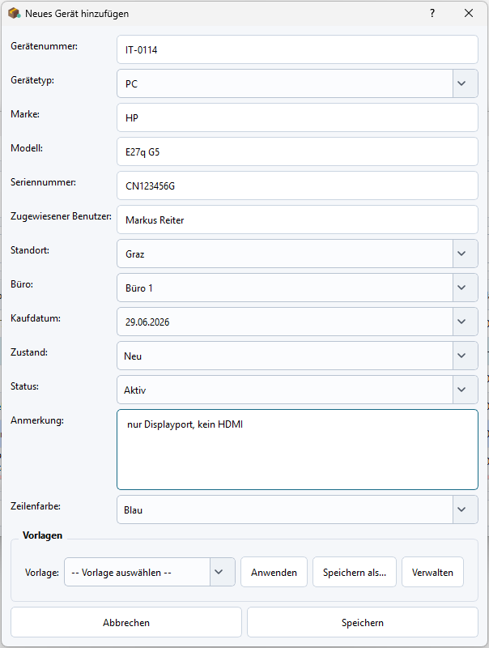
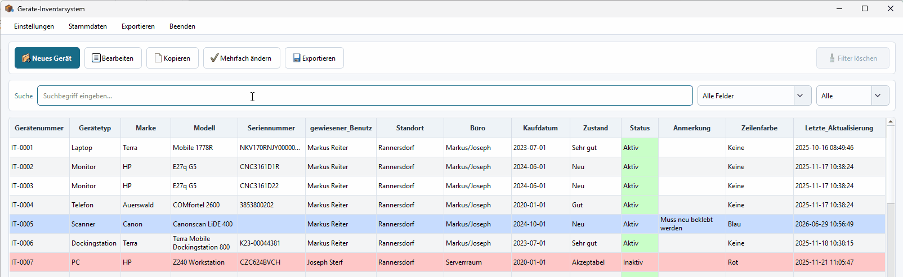

# Inventarsystem für elektronische Geräte

Eine PyQt5-Desktopanwendung zur Verwaltung von IT- und Elektronik-Inventar. Der Fokus liegt auf einem praktischen Arbeitsablauf: Geräte erfassen, Tabellen durchsuchen und filtern, Stammdaten pflegen, mehrere Geräte gleichzeitig ändern und die aktuelle Ansicht als CSV exportieren.

## Vorschau







## Warum dieses Projekt existiert

Kleine IT-Teams verwalten Gerätebestände häufig in Tabellen, bis Suche, Pflege und Auswertung unübersichtlich werden. Diese Anwendung behält die einfache CSV-Speicherung bei, ergänzt sie aber um eine strukturierte Desktop-Oberfläche, wiederverwendbare Dialoge, konfigurierbare Stammdaten und testbare Geschäftslogik.

## Funktionen

- Verwaltung von PCs, Laptops, Monitoren, Telefonen, Servern und weiteren Geräten
- Suche über alle Felder oder gezielt in einer ausgewählten Spalte
- Statusfilter und Excel-ähnliche Spaltenfilter
- Mehrfachänderung für ausgewählte Tabellenzeilen
- Konfigurierbare Gerätetypen, Standorte, Büros, Zustände, Statuswerte, Zeilenfarben und Nummernkreise
- CSV-Export der gefilterten Ansicht
- Lokale Speicherung von Fenstergröße und Spaltenbreiten
- Klare Trennung von Oberfläche, Persistenz und reiner Datenlogik
- Pytest-Tests für Kernlogik und CSV-Persistenz

## Tech-Stack

- Python
- PyQt5
- pandas
- pytest
- PyInstaller-Unterstützung für Windows-Builds

## Architektur

```text
main.py                         # QApplication-Setup und Einstiegspunkt
inventory_app/
    constants.py                # Standard-Stammdaten und kanonisches CSV-Schema
    core.py                     # Reine Filter-, Nummernkreis- und Statuslogik
    repository.py               # CSV-Lade-/Speicherschicht mit Schema-Normalisierung
    main_window.py              # Hauptfenster und Tabellen-Workflow
    dialogs/                    # PyQt5-Dialoge für Geräte, Filter, Einstellungen usw.
tests/                          # Unit-Tests für Kernlogik und Persistenz
inventory.csv                   # Ein anonymisierter Demo-Datensatz
inventory_config.example.json   # Beispiel für die lokale Konfiguration
```

Eine zentrale Designentscheidung ist, dass `core.py` keine Qt-Abhängigkeit hat. Filterlogik, ID-Erzeugung und Statusübersichten können dadurch ohne laufende Desktop-Oberfläche getestet werden. Die Repository-Schicht kapselt CSV-Details und richtet geladene Daten am Schema aus `constants.py` aus.

## Datenhaltung

Die Inventardaten werden in `inventory.csv` gespeichert. Die Repository-Schicht:

- liest CSV-Werte als Strings, damit IDs und Seriennummern erhalten bleiben
- normalisiert Dateien auf das aktuelle Spaltenschema
- schreibt mit expliziter UTF-8-Kodierung
- speichert zuerst in eine temporäre Datei und ersetzt anschließend atomar die Zieldatei

Die automatisch erzeugte `inventory_config.json` wird absichtlich nicht versioniert. Sie enthält lokale Einstellungen wie Fenstergröße, Spaltenbreiten, ausgewählte CSV-Datei und angepasste Stammdaten.

## Installation

Virtuelle Umgebung erstellen und Abhängigkeiten installieren:

```bash
pip install -r requirements.txt
```

Anwendung starten:

```bash
python main.py
```

Entwicklungsabhängigkeiten installieren:

```bash
pip install -r requirements-dev.txt
```

Tests ausführen:

```bash
pytest
```

## Verwendung

### Gerät hinzufügen

1. `Neues Gerät` anklicken.
2. Gerätedaten eintragen.
3. Dialog speichern.

### Suchen und Filtern

- Das Suchfeld für freie Textsuche verwenden.
- Über das Dropdown von `Alle Felder` auf ein bestimmtes Feld wechseln.
- Den Statusfilter für schnelle Statusauswahl nutzen.
- Per Rechtsklick auf einen Tabellenkopf sortieren oder nach Spaltenwerten filtern.

### Gerät bearbeiten oder kopieren

- Eine Zeile markieren und `Bearbeiten` anklicken.
- Per Doppelklick eine Zeile direkt bearbeiten.
- Mit `Kopieren` ein ähnliches Gerät duplizieren; eindeutige Felder wie die Seriennummer werden dabei geleert.

### Mehrfachänderung

1. Mehrere Zeilen mit Strg oder Shift markieren.
2. `Mehrfach ändern` anklicken.
3. Die Felder aktivieren, die geändert werden sollen.
4. Änderung auf alle ausgewählten Geräte anwenden.

### Stammdaten pflegen

Über `Stammdaten` können Gerätetypen, Standorte, Büros, Zustände, Statuswerte, Zeilenfarben und das Format der Gerätenummern angepasst werden.

## Paketierung

PyInstaller installieren und eine Windows-EXE bauen:

```bash
python -m pip install --upgrade pyinstaller
pyinstaller --noconfirm --windowed --icon logistics.ico --add-data "inventory_app/assets;inventory_app/assets" --name Inventarsystem main.py
```

Das Ergebnis liegt anschließend in `dist/Inventarsystem`. Beim ersten Start erstellt die Anwendung `inventory.csv` und `inventory_config.json` neben der EXE, falls die Dateien noch nicht vorhanden sind.

## Portfolio-Hinweise

Dieses Projekt zeigt:

- Aufbau eines vollständigen Desktop-CRUD-Workflows
- Trennung von GUI-Code und testbarer Geschäftslogik
- defensivere CSV-Persistenz
- konfigurierbare Stammdaten statt fest verdrahteter Dropdown-Werte
- automatisierte Tests für nicht-visuelles Verhalten

## Lizenz

MIT-Lizenz. Details siehe [LICENSE](LICENSE).
